# Quickwins-ADFGit
**Produced by Dave Lusty**

# Introduction

This quick win shows how to use a Git repository with branches to version code between dev and production data factories. I don't cover using DevOps, but the method here integrates well with DevOps pipelines.

You can find the [video demo here](https://www.youtube.com/) NOT YET LIVE

# Git Repository

For this demo we'll use GitHub, but other Git implementations are available including Azure DevOps. We'll be creating a new repository and then two branches within that, one (Master) will be used for production and the other (Dev) will be our development environment. There are no limits to the number of branches you can use here, and so standard DevOps and development branching can be used including feature branches.

## Create the Repository

From the GitHub homepage, click the New button to create a new repository.
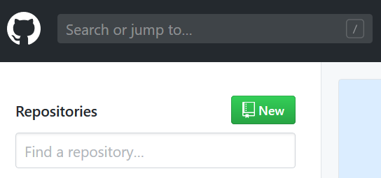

Next, give the repository a name such as "DemoADFRepo" and a description. Choose private unless you really want to share this with the world. There are few scenarios where you'd want a Data Factory pipeline to be public aside from education or demo purposes so generally you'll want to keep these private and locked down. Initialise with a README file so you have somewhere to explain what's in the repo to any colleagues who may find it later. This is important since there's nothing stopping you removing the repository which would potentially break your Data Factory so good naming and a good README will help to prevent accidental removal. It's a good idea to clone elsewhere as a backup too.
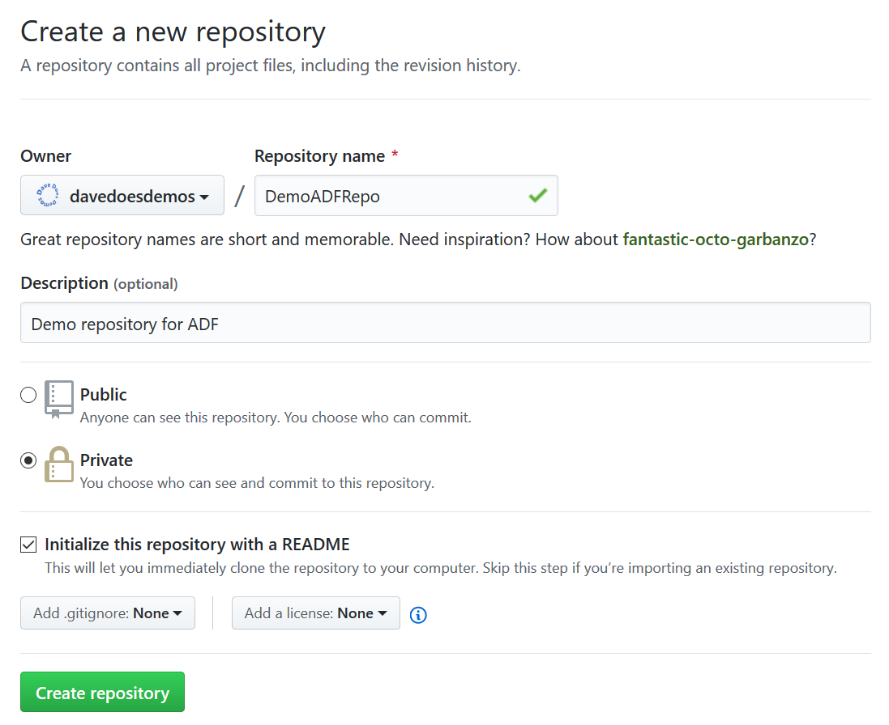

## Create Branches

Now, click the branch button and type Dev into the search. Click "Create Branch: Dev" to create the new branch we'll use for test.
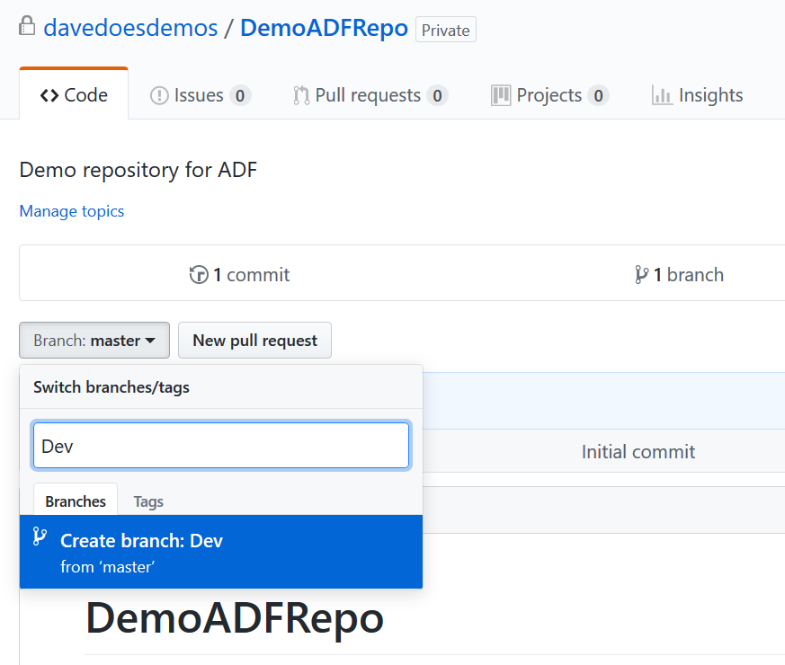

We already had a Master branch by default, so that's it, we're all set up in GitHub already!

# Data Factory

## Create ADF resources

Now, log in to the Azure portal and create a new Data Factory. We need to create one called ADFGitDev and one called ADFGitProd. Create a new Resource group called DemoADFGit so we can clean up later on. Tick the "Enable Git" box and fill in the details for your repository. For the ADFGitDev use branch Dev and for ADFGitProd use Master.
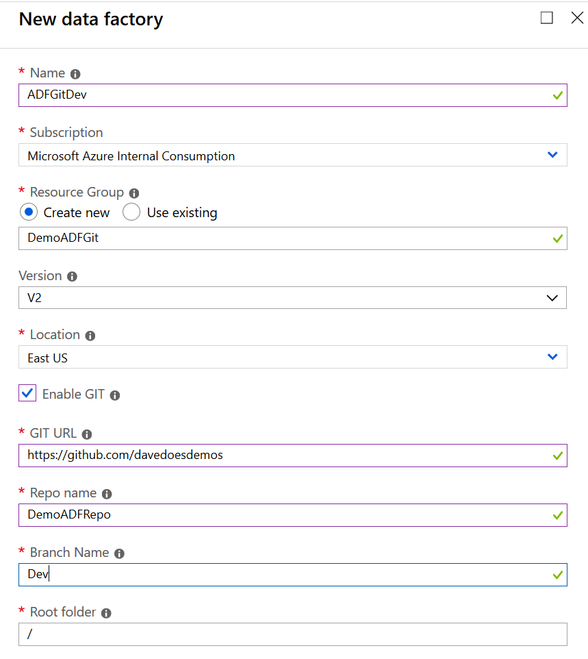

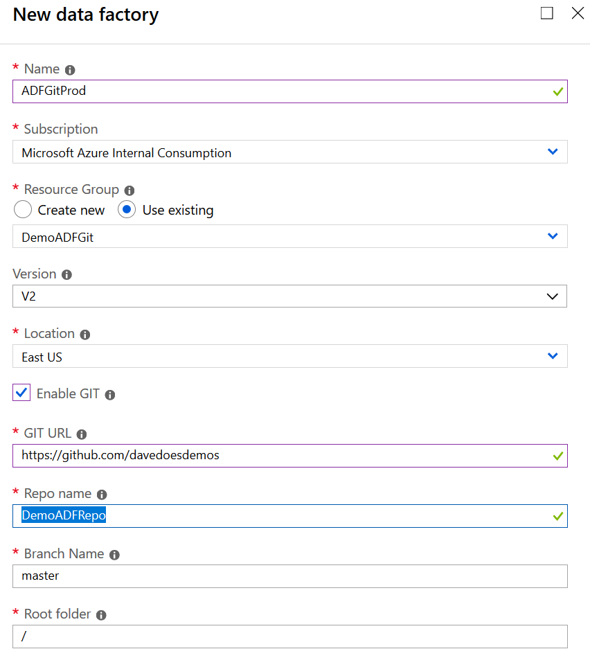

## Configure ADFGitDev

In the portal, open ADFGitDev and then click Author & Monitor. Click the edit button on the menu to begin designing pipelines. You'll be prompted for the working branch. Select Dev from the drop down list and click save. You may also be prompted to log in to GitHub and authorise the connection, if so then follow the instructions on screen.

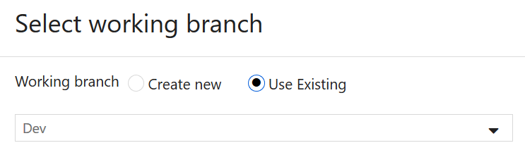

In the designer, click the plus and create a pipeline then drag a copy activity onto the designer. Click Save All on the menu. We don't need to fully configure this pipeline since we're just showing the Git functionality.

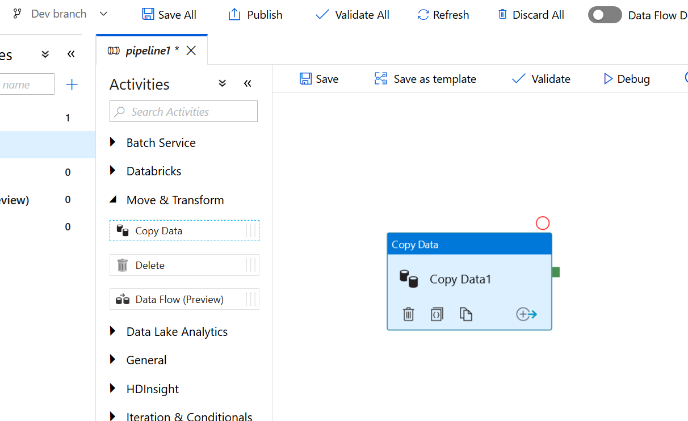

## Configure ADFGitProd

Now go back to the portal and open ADFGitProd and click Author and monitor. Another ADF designer window will open. Click the edit button again and this time choose Master when prompted for the working branch then click save.

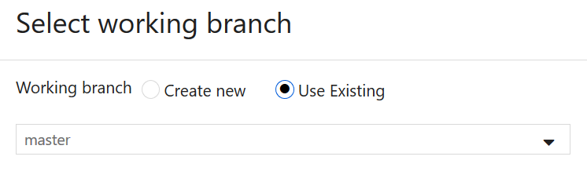

You now have an empty designer with no pipelines in "production" and one pipeline with a copy activity in "Development".

# DevOps

At this point, we'll imagine that testing has taken place, and that in Azure DevOps we have an approval process. Obviously for this to be a quick win demo we don't have those things so we'll do the next steps manually. First, we create a pull request, and then we merge the Dev branch into Master. This will copy the code changes between environments, effectively making the changes live in "Production".

In Github click "New Pull Request" in the Dev branch.

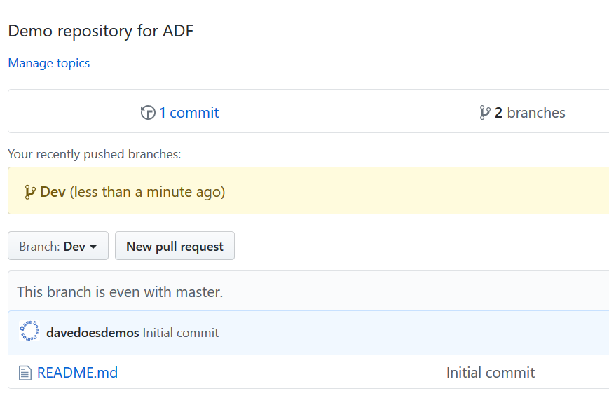

The system will automatically give you a pull request name, but it's good practice to add comments and descriptive names here. If you need to roll back versions in production you'll be glad you did. Click "Create pull request" when finished.

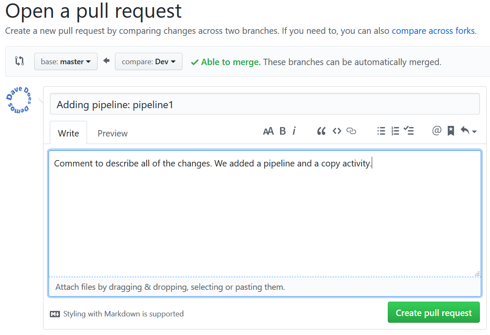

It's possible here to compare the code between production and Dev to see what's changed. to do so, click the "Files Changed" tab. Here, you'll see all added files and changed lines within the JSON files. This makes it easy to compare and decide if the changes are OK.

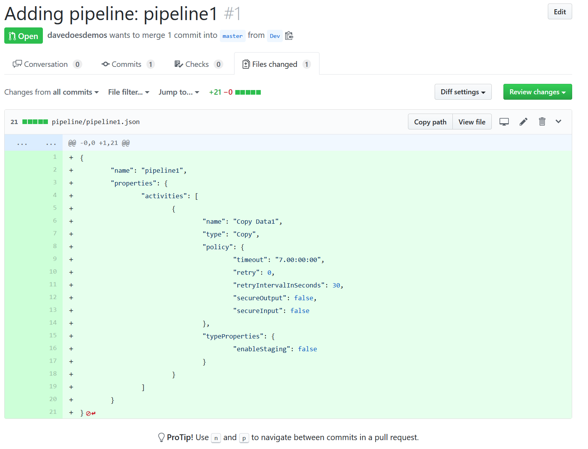

At this point you'd normally have a different person authorise and merge the code. For our demo, just click "Merge pull request" to merge the code.

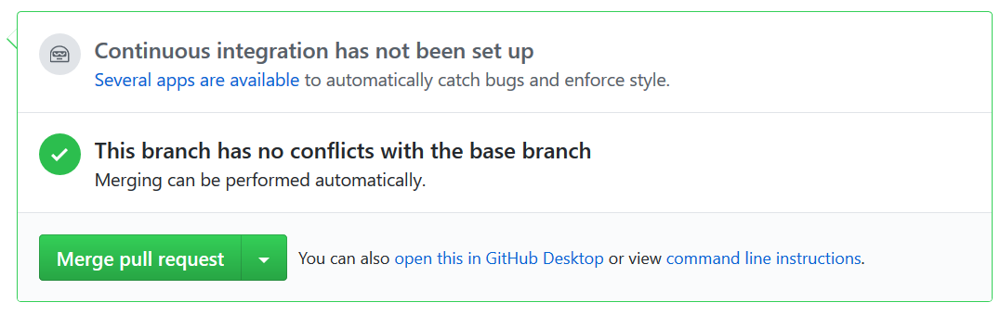

Then add a comment and click "Confirm Merge".

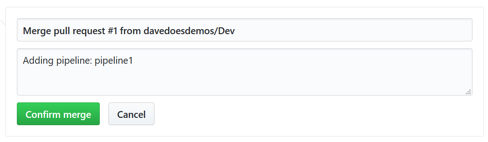

Now head back into your ADFGitProd designer in your browser and hit refresh on the menu.

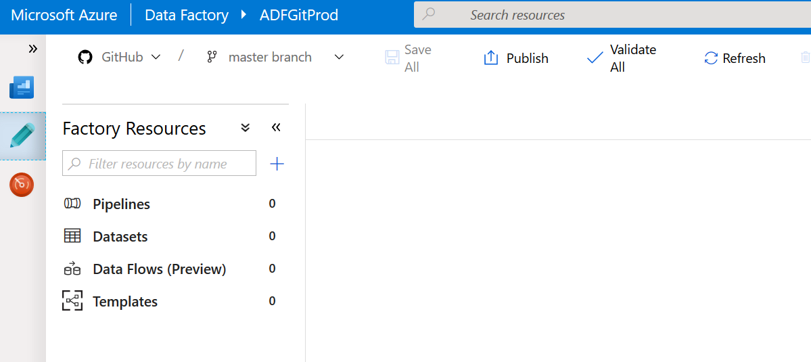

Now you'll see the changes you merged appear in the designer including the copy job.

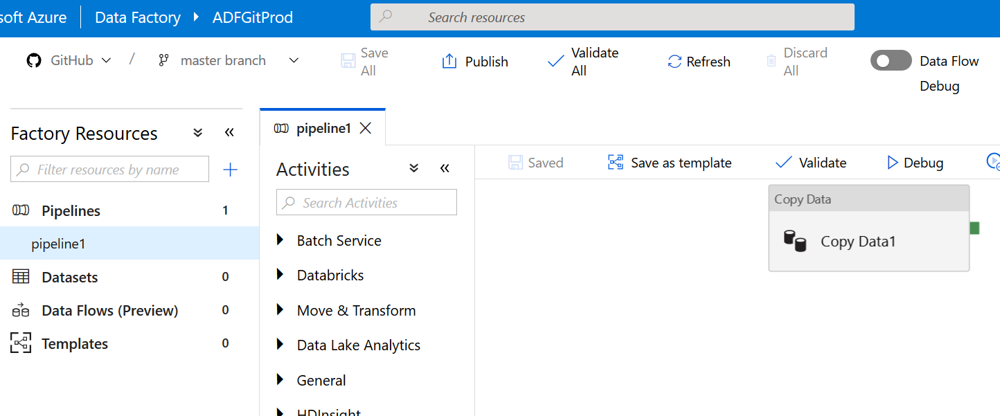

# Conclusion

With the skills above you can build out a controlled pipeline deployment process in Azure Data Factory which includes version control, roll backs, approvals and more. 